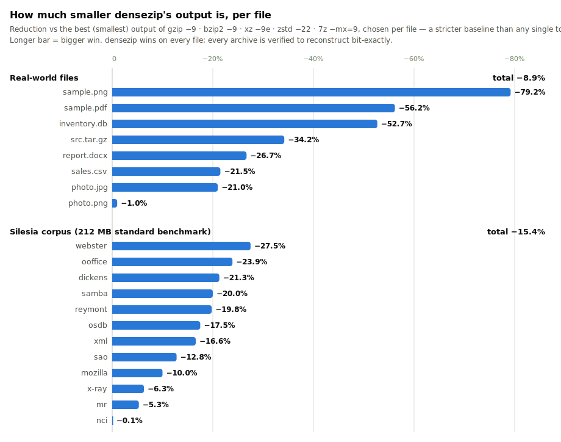

# densezip

[](https://github.com/dannyblaker/densezip/actions/workflows/ci.yml)

An archiver whose only goal is the **smallest possible output** — smaller than
`gzip -9`, `xz -9e`, `zstd --ultra -22`, and `7z -mx=9` on real-world files.
Speed and memory are explicitly sacrificed for ratio.

The CLI command is `dnz` and archives use the `.dnz` extension.

## Install

Linux / macOS:

```sh
curl -fsSL https://raw.githubusercontent.com/dannyblaker/densezip/master/install.sh | bash
```

Windows (PowerShell):

```powershell
irm https://raw.githubusercontent.com/dannyblaker/densezip/master/install.ps1 | iex
```

Both install the latest stable release (prebuilt for Linux x86_64/arm64,
macOS Intel/Apple Silicon, and Windows x86_64). Or build from source with
Rust stable: `cargo build --release`.

### Updating

```sh
dnz update
```

This checks GitHub for the latest release and, if you're behind, replaces the
installed binary in place (`--force` reinstalls even when already current).
Re-running the install one-liner above does the same thing. If you built from
source, update with `git pull && cargo build --release` instead — `dnz update`
detects source builds and won't overwrite them.

To pin or roll back to a specific version, pass a tag to the installer:

```sh
DNZ_VERSION=v0.1.0 curl -fsSL https://raw.githubusercontent.com/dannyblaker/densezip/master/install.sh | bash
```

(on Windows: `$env:DNZ_VERSION="v0.1.0"` before running the PowerShell
one-liner). Check what you have with `dnz --version`.

## Usage

```
dnz a archive.dnz <files/dirs...>   # create (verifies bit-exact reconstruction)
dnz x archive.dnz -o <dir>          # extract
dnz t archive.dnz                   # verify integrity
dnz ls archive.dnz                  # list contents
```

Options: `--no-cm` disables the slow context-mixing backend (much faster,
still beats 7z on most container formats); `--no-verify` skips the post-pack
self-check; `--mem <GiB>` caps memory use; `--progress` shows a live
progress bar with an ETA on stderr (works on `a`, `x`, and `t`)

**Memory budget:** by default densezip auto-detects available RAM and uses up
to 75% of it, sizing its model tables, LZMA dictionaries, and job concurrency
to fit — so it runs safely on an 8 GB laptop and simply uses bigger models on
a workstation. `--mem 2` forces a 2 GiB budget explicitly. The cost of small
budgets is tiny (measured on sample.pdf: 2 GiB costs +0.02% output size,
512 MiB +0.13%). Extraction needs roughly the model memory chosen at pack
time (at most ~3.3 GiB, less for archives packed with a small `--mem`), so
pack with `--mem` matched to the smallest machine that must read the archive.

## Why it wins

Three stacked ideas, each validated by measurement (see
[WHITEPAPER.md](WHITEPAPER.md) for the full technical treatment with
diagrams and the underlying math):

**1. Recompression.** Most "hard to compress" files are already-compressed
containers: PDFs, PNGs, docx/xlsx, jar, gz — all deflate inside. densezip
finds every embedded deflate stream ([preflate-rs](https://github.com/microsoft/preflate-rs)),
losslessly unpacks it, compresses the *raw* content with far stronger codecs,
and stores a small correction record so the original bytes are reconstructed
**bit-exactly**. JPEGs (standalone or inside PDFs) get the same treatment via
[lepton](https://github.com/microsoft/lepton_jpeg_rust) (~20% smaller,
lossless). PNG pixels are additionally unfiltered and color-decorrelated when
that helps.

**2. A context-mixing compressor (`dzcm`).** The strongest known general
compressors (PAQ family) predict one bit at a time from many context models
blended by an online-trained mixer. dzcm is a clean-room Rust implementation:
orders 0–8, word, sparse, and record/2D-image context models with bit-history
states, an ISSE refinement chain, a two-bank logistic mixer, three APM/SSE
stages, plus an autodetected E8/E9 x86 branch transform and record-stride
detection. Pure integer math — output is bit-identical across platforms.
On the Silesia corpus it beats `xz -9e` by 13–24%.

**3. Backend racing.** No single codec wins everywhere, and we don't care
about time — so every stream is compressed with zstd, brotli, LZMA, *and*
dzcm in parallel (plus alternate pixel representations for images), each
round-trip verified, and the smallest wins. A stored fallback means output
never meaningfully expands, even on random data.

## Correctness

The format never trusts heuristics:

* every transform is verified at pack time — each file is re-rendered and
  byte-compared before it is committed (mismatch ⇒ that file is stored raw);
* every backend output is decompressed and compared before being accepted;
* after writing, the whole archive is read back and every file verified
  against its xxh3 hash (`--no-verify` to skip);
* `dnz t` re-verifies everything, and truncated/corrupted archives fail
  cleanly (tested).

## Architecture

```
input file
  └─ scan: deflate streams (zlib/gzip/zip/PDF), PNG IDAT runs, JPEGs
       └─ L1 recompression: preflate / lepton  → raw content + corrections
            └─ L2 transforms: PNG unfilter, sub-green decorrelation,
                              E8/E9 x86, record-stride detection
                 └─ L3 racing: store | zstd-22 | brotli-11 | LZMA | dzcm
                               → smallest verified output per channel
```

Streams are grouped into solid channels (literals, corrections, filters,
lepton blobs, per-image pixels) shared across all files in the archive, so
similar content compresses together. The TOC stores a reversible "plan tree"
per file; extraction replays it bottom-up.

## Benchmarks

densezip wins on **all 20 files** across both corpora — against the *best*
of gzip/bzip2/xz/zstd/7z chosen per file, a stricter baseline than any
single tool:

<picture>
  <source media="(prefers-color-scheme: dark)" srcset="assets/benchmarks-dark.svg">
  
</picture>

Run `bench/bench.sh <corpus-dir>` to reproduce (also verifies every
archive); see [BENCHMARKS.md](BENCHMARKS.md) for the full tables. The chart
is generated from them by `bench/readme_chart.py`.

## Building & testing

```
cargo build --release
cargo test --release        # 14 integration + 9 unit tests, all round-trip based
```

Requires Rust stable. The compressor allocates large hash tables (hundreds of
MB to a few GB depending on input size) and uses all cores for backend racing.

## Status

The format is young (v0.1) and may still change between versions — don't use
`.dnz` as your only copy of anything yet. Every archive is self-checked at
pack time, and `dnz t` verifies bit-exact reconstruction at any time.

## License

AGPL-3.0-or-later. If you want to use densezip in a proprietary product,
contact me about a commercial license.

densezip builds on excellent open-source work:
[preflate-rs](https://github.com/microsoft/preflate-rs) and
[lepton_jpeg_rust](https://github.com/microsoft/lepton_jpeg_rust) (Microsoft,
Apache-2.0), plus the zstd, brotli, and lzma-rust2 crates. The dzcm
context-mixing engine is an original implementation inspired by the published
PAQ/ZPAQ architecture.
