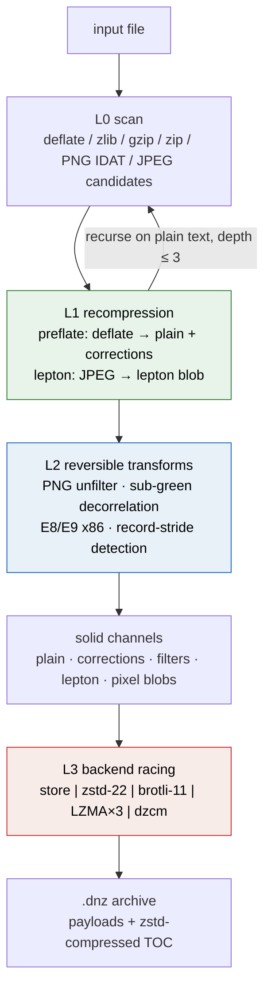
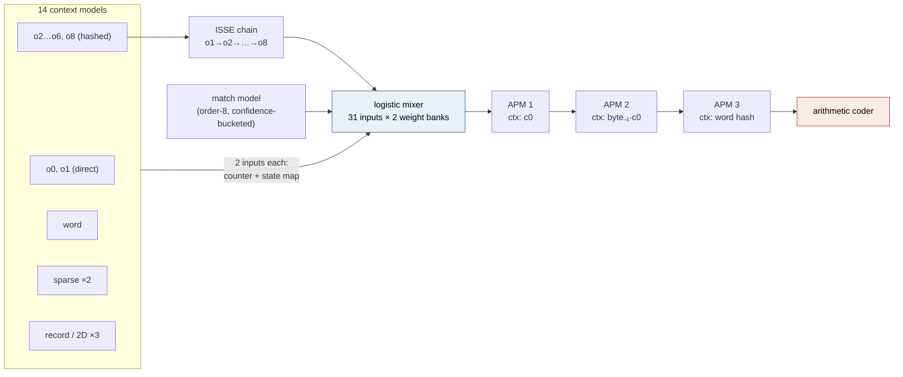
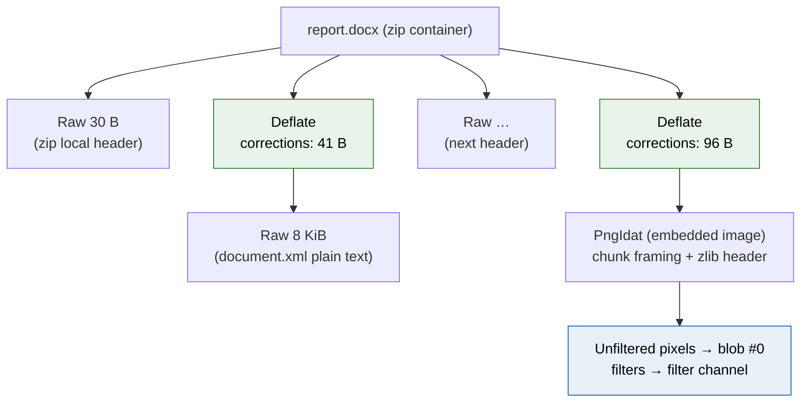
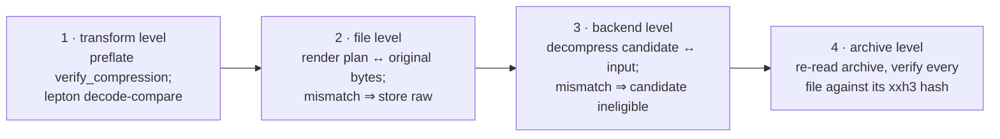
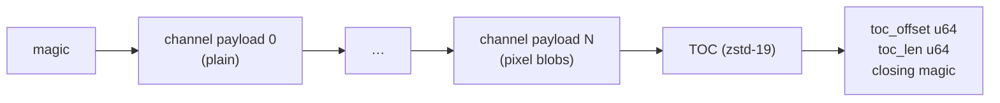
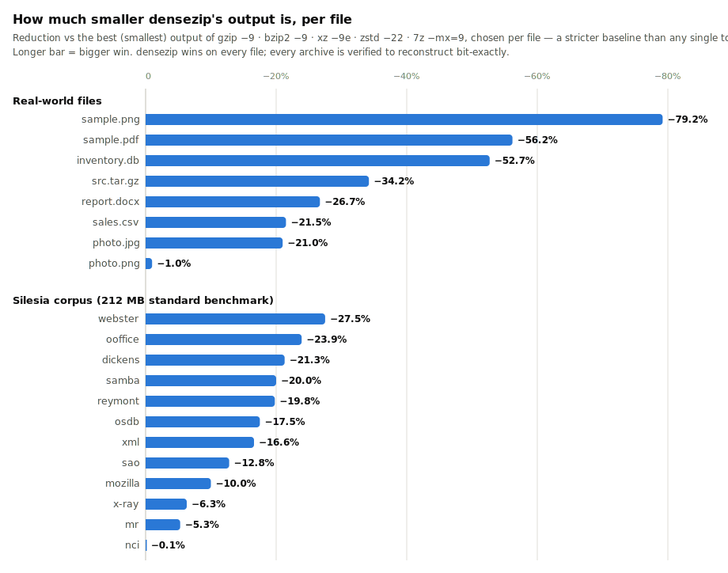

# Dense Zip: Maximum-Ratio Lossless Archiving via Recompression, Context Mixing, and Backend Racing

**Danny Blaker** · July 2026 · v0.1

> This paper describes the design and implementation of densezip, an archiver
> whose sole objective is minimum output size under a hard bit-exact
> reconstruction constraint. On a mixed real-world corpus densezip produces
> archives 8.9% smaller — and on the Silesia corpus 15.4% smaller — than the
> *best per-file result* among `gzip -9`, `bzip2 -9`, `xz -9e`,
> `zstd --ultra -22`, and `7z -mx=9`, winning on every file tested.

---

## 1. Problem statement

Let *F* be an input file (or file set) and $A$ a compressor. Conventional
compressors optimize a ratio/speed trade-off. densezip solves the degenerate
but practically interesting corner of that space:

```math
\min_{A} \; |A(F)| \quad \text{subject to} \quad A^{-1}(A(F)) = F \;\text{(bit-exact)},
```

with **no constraint on CPU time or memory** beyond what a commodity machine
can supply. This objective changes the engineering calculus in three ways:

1. It becomes rational to *undo* prior compression and redo it with a
   stronger model (§3).
2. It becomes rational to use compressors that are orders of magnitude
   slower than LZ77 derivatives, i.e. context mixing (§5).
3. It becomes rational to run *every* candidate codec on every stream and
   keep the smallest verified output, since compression time is free (§6).

The information-theoretic floor is the Shannon limit: an ideal coder spends
$-\log_2 p(x)$ bits on a symbol the model assigns probability $p(x)$, so the
expected output size for data drawn from source distribution $P$ under model
$Q$ is the cross-entropy

```math
H(P, Q) \;=\; -\sum_{x} P(x)\,\log_2 Q(x) \;=\; H(P) + D_{\mathrm{KL}}(P \,\|\, Q).
```

Every densezip design decision is an attack on one of the two terms: the
recompression layer shrinks $H(P)$ by transforming the data into a
representation with more exploitable structure, and the context-mixing layer
shrinks $D_{\mathrm{KL}}$ by learning a better $Q$.

## 2. System overview

densezip processes each file through three stacked layers, then groups the
results into solid channels shared across the whole archive:



The decomposition of each file is recorded as a reversible **plan tree**
(§7); extraction renders the tree bottom-up. Correctness never depends on
any heuristic in this pipeline: every transform is verified by re-rendering
and byte-comparison at pack time, and any failure falls back to storing the
affected bytes literally (§8).

## 3. Layer 1 — Recompression

### 3.1 Why already-compressed data is the main opportunity

Most "incompressible" real-world files are containers around DEFLATE
streams: PDF (`FlateDecode`), PNG (`IDAT`), docx/xlsx/jar (zip members),
gzip. DEFLATE's LZ77+Huffman output has near-maximal byte entropy, so a
downstream compressor sees $H(P) \approx 8$ bits/byte and can do almost
nothing — which is why `xz -9e` shaves only ~0.3% off a `.tar.gz`.

The plain text *inside* those streams, however, is typically highly
structured. The winning move is to invert the DEFLATE encoding, compress
the plain text with a stronger model, and record enough side information to
reproduce the original stream exactly.

### 3.2 Bit-exact stream inversion

Naively re-deflating plain text does not reproduce the original bytes:
DEFLATE encoders differ in match selection, block splitting, and Huffman
table construction. densezip uses [preflate](https://github.com/microsoft/preflate-rs),
which decomposes a deflate stream $D$ into

```math
D \;\longmapsto\; (P, C), \qquad \text{recreate}(P, C) = D,
```

where $P$ is the decompressed plain text and $C$ is a small **correction
record** capturing the original encoder's choices. For streams produced by
common zlib-family encoders, $|C| \ll |D|$ (typically well under 1% of
$|D|$). The net gain condition for recompressing a stream with backend
$\beta$ is

```math
|\beta(P)| + |C| \;<\; |D|,
```

which holds by a wide margin in practice: text extracted from a PDF
compresses ~2× smaller through dzcm than its original FlateDecode stream.

JPEGs get the same treatment via [lepton](https://github.com/microsoft/lepton_jpeg_rust),
which re-codes the DCT coefficients with an adaptive arithmetic coder and
verifies an internal decode-compare, yielding ~20% savings losslessly —
including JPEGs embedded inside PDFs.

### 3.3 Candidate scanning and recursion

A single linear scan flags candidate offsets by signature: zlib headers
(first two bytes $h$ with $h \equiv 0 \pmod{31}$ and no preset dictionary),
gzip magic, zip local-file headers with method 8, PNG signatures with
CRC-validated chunks, and JPEG SOI markers. Each candidate is *attempted*;
failures roll back cleanly (§7). Because the plain text of one stream often
contains further streams (a zip inside a PDF; a gzip inside a tar), the
scanner recurses on recovered plain text to depth 3.

Streams shorter than 64 bytes of plain text are left alone — correction and
metadata overhead would eat the gain.

## 4. Layer 2 — Reversible transforms

These transforms do not compress; they *reshape* data so downstream models
find its structure. Each is exactly invertible and carries no correction
data.

### 4.1 PNG unfiltering

PNG scanlines are stored filtered: each row is transformed by one of five
per-row filters (None, Sub, Up, Average, Paeth) applied to pixel bytes,
e.g. for filter type 4:

```math
\mathrm{filtered}[i] = \mathrm{raw}[i] - \mathrm{Paeth}\big(a, b, c\big), \qquad
\mathrm{Paeth}(a,b,c) = \underset{v \in \{a,b,c\}}{\arg\min} \; |a + b - c - v|,
```

where $a$, $b$, $c$ are the left, above, and above-left neighbors. Filtering
helps DEFLATE (it converts smooth gradients into near-zero residuals) but
*hides* the 2D structure from a stronger model. densezip removes the
filters, stores the filter-type bytes (one per row) in their own channel,
and hands the raw pixel array — with known row stride and bytes-per-pixel —
to the compressor, whose 2D context models then see actual pixel
neighborhoods (§5.4). Both representations are cheaply estimated with
zstd-12 and the smaller one is kept, so unfiltering is only used when it
actually helps.

### 4.2 Color decorrelation (sub-green)

RGB channels are strongly correlated; green carries most luminance. For
RGB(A) pixel blobs, densezip races an additional representation

```math
(R, G, B, A) \;\longmapsto\; (R - G,\; G,\; B - G,\; A) \pmod{256},
```

the reversible sub-green transform (as in WebP lossless). Whichever
representation compresses smaller wins.

### 4.3 E8/E9 branch transform

x86 code stores CALL/JMP targets as *relative* displacements, so identical
calls to one function have different byte encodings at each call site. When
input looks like x86 (call-site density heuristic: plausible E8/E9 sites
more than ~1 per 1.5 KB), each displacement at offset $i$ is rewritten to an
absolute target

```math
\mathrm{abs} = \mathrm{rel} + i + 5 \pmod{2^{32}},
```

stored big-endian so high bytes cluster. Both directions scan identically
and skip 5 bytes after each hit, making the transform exactly reversible
without correction data.

### 4.4 Record stride detection

Tabular data (database pages, fixed-size structs, sensor logs) has a
periodic layout. densezip estimates the period by sampled autocorrelation:

```math
s^{*} = \underset{2 \le s \le 4096}{\arg\max} \;\; \Pr\big[\,\mathrm{buf}[i] = \mathrm{buf}[i - s]\,\big],
```

sampling every 37th position over a 2 MiB window. The stride is accepted
only on a clear signal (match rate ≥ 18% and ≥ 1.5× the median over all
candidate strides) and is fed to the record models of §5.4. For PNG pixel
blobs the stride and bytes-per-pixel are known exactly and detection is
skipped.

## 5. Layer 3 — dzcm, a context-mixing compressor

dzcm is a clean-room Rust implementation in the lpaq/zpaq family: a
bitwise arithmetic coder driven by an ensemble of context models blended by
an online-trained mixer. It is the strongest backend on text, code, and
structured binary data, and the slowest (~0.15–0.3 MB/s). All arithmetic is
integer-only with a precomputed logistic table, so output is bit-identical
across platforms.

### 5.1 Prediction pipeline

For every bit, dzcm produces a 12-bit probability through this dataflow:



### 5.2 Arithmetic coding

A binary range coder maintains an interval $[x_1, x_2] \subseteq [0, 2^{32})$
and splits it at $x_{\mathrm{mid}} = x_1 + \lfloor (x_2 - x_1) \cdot p / 2^{12} \rfloor$
for each predicted $p = \Pr[\mathrm{bit} = 1]$. The realized code length is

```math
L = \sum_{i} -\log_2 q_i, \qquad
q_i = \begin{cases} p_i & \text{bit}_i = 1 \\ 1 - p_i & \text{bit}_i = 0, \end{cases}
```

so every component downstream is trained to minimize exactly this
cross-entropy loss.

### 5.3 Probability domain: stretch and squash

Mixing happens in the logistic (log-odds) domain, mapped by

```math
\mathrm{squash}(x) = \frac{4096}{1 + e^{-x/256}}, \qquad
\mathrm{stretch}(p) = \mathrm{squash}^{-1}(p) = 256 \ln \frac{p}{4096 - p},
```

with $x \in [-2047, 2047]$ and $p \in (0, 4096)$. Both are precomputed
integer tables (`cm_tables.rs`), which is what makes the whole pipeline
deterministic across platforms — no floating point, no libm.

### 5.4 Context models

Each of the 14 models hashes its context to a 4-byte slot in a table of
$2^{b}$ entries (an 8-bit tag detects collisions and resets stale slots).
A slot holds **two** predictors, both fed to the mixer (a "hybrid ICM"):

- a direct 16-bit probability counter, updated toward the observed bit with
  an adaptive rate $\eta_n = \frac{1}{n+2}$ keyed by how much history the
  slot has seen (fast when fresh, stable when confident);
- an 8-bit **bit-history state**: a bounded $(n_0, n_1)$ counter-pair
  automaton (~120 states) with non-stationarity discounting — on observing
  bit 1, $n_1 \leftarrow n_1 + 1$ and if $n_0 > 2$, $n_0 \leftarrow n_0/2 + 1$
  — mapped through a per-model **state map** (state → probability, also
  adaptively updated with a rate floor so it never stops adapting).

The contexts:

| model | context |
|---|---|
| o0, o1 | none / previous byte (direct-indexed) |
| o2 … o6, o8 | last 2…6, 8 bytes (hashed) |
| word | hash of the current alphabetic word (resets on non-letters) |
| sparse 1 | bytes at offsets −2, −3 (skipping −1) |
| sparse 2 | high nibbles of the last 4 bytes |
| record 1–3 | byte one and two strides above, column number — or, for images, the (above, left) neighborhood and the 2D gradient $\mathrm{above} + \mathrm{left} - \mathrm{aboveleft}$ in the same color channel |

An **order-8 match model** hashes the last 8 bytes into a position table;
on a verified 8-byte match it predicts the next bit of the matched
occurrence, weighted by a confidence counter bucketed by match length and
expected bit. Match hit rate is itself learned, not assumed.

### 5.5 ISSE refinement chain

Rather than treating orders independently, orders 2→3→4→5→6→8 form an
**ISSE chain** (as in zpaq): each stage is a tiny 2-weight mixer, selected
by the higher order's bit-history state $s$, that refines the running
prediction

```math
t_{k} = \mathrm{clamp}\!\big(w_{s,0}\, t_{k-1} + w_{s,1}\, \mathrm{stretch}(p_k)\big),
```

seeded with $t_1 = \mathrm{stretch}(p_{o1})$ and initialized at
$(w_0, w_1) = (0.75, 0.25)$ in fixed point. Each stage trains on its own
output error. The chain output enters the mixer as one more input — it
supplies a "consensus of increasing order" view that individual models
cannot express.

### 5.6 Logistic mixing

The mixer computes, over $n = 31$ inputs $t_i = \mathrm{stretch}(p_i)$ (two
per model, plus chain, match, and bias):

```math
p_{\mathrm{mix}} = \mathrm{squash}\!\left( \sum_{B \in \{1,2\}} \sum_{i=1}^{n} w^{(B)}_{c_B, i}\, t_i \right),
```

with **two weight banks** selected by different contexts — bank 1 by the
partial byte $c_0$ and whether a match is active, bank 2 by the previous
byte and a match-length bucket — summed before the squash (paq8-style).
After coding each bit $y \in \lbrace 0,1 \rbrace$, both banks receive the online
logistic-regression update

```math
w^{(B)}_{c_B, i} \mathrel{+}= \eta \; t_i \,\big(y - p_{\mathrm{mix}}\big),
```

which is exact gradient descent on the coding loss $-\log_2 q$: weights grow
for models that were right when the blend was wrong. This is the mechanism
that makes an ensemble of heterogeneous models self-organize per data type —
on text the word and high-order models win the weights; on a SQLite page the
record models do; on random data everything converges toward the bias.

### 5.7 SSE / APM stages

Three adaptive probability maps then refine $p_{\mathrm{mix}}$
conditioned on progressively richer contexts (current partial byte; previous
byte × partial byte; current word hash). An APM interpolates between 33
buckets in the stretch domain:

```math
p' = (1 - \lambda)\, T[c, j] + \lambda\, T[c, j{+}1], \qquad
j, \lambda \;\text{from}\; \mathrm{stretch}(p),
```

and nudges the two active buckets toward each outcome. Each stage's output
is blended with its input ($\tfrac{1}{4}$ input, $\tfrac{3}{4}$ refinement
for the first two stages; half/half for the word stage)
— APMs correct calibration error without being trusted outright.

### 5.8 Memory scaling

Table size adapts to input length $\ell$ and the memory budget:

```math
b = \mathrm{clamp}\big(\lceil \log_2 \ell \rceil + 3,\; 16,\; 26\big), \qquad
\mathrm{mem}(b) \approx 12 \cdot 4 \cdot 2^{b} + 4 \cdot 2^{b_m} + 2^{20} \;\text{bytes},
```

reduced until it fits the per-job budget (§9). The chosen geometry is
recorded in the stream header, so decompression allocates exactly what
compression used — an archive packed with `--mem 2` extracts within the
same bound. Measured cost of small budgets is tiny: +0.02% output at a
2 GiB budget, +0.13% at 512 MiB.

## 6. Backend racing

No single codec wins everywhere. Because time is explicitly not a goal,
densezip runs *all* applicable backends on every channel in parallel and
keeps the smallest output **that round-trips**:

```math
\beta^{*}(x) = \underset{\beta \in \mathcal{B}}{\arg\min} \; |\beta(x)|
\quad \text{s.t.} \quad \beta^{-1}(\beta(x)) = x,
\qquad
\mathcal{B} = \{\text{store}, \text{zstd}, \text{brotli}, \text{LZMA}, \text{dzcm}\}.
```

Details that matter in practice:

- **LZMA is itself a race** over three parameter sets
  $(lc, lp, pb) \in \lbrace (3,0,2), (3,0,0), (0,0,0) \rbrace$ — the `.lzma` header is
  self-describing, so all three share one backend id. This decided the
  closest benchmark file (`nci`, −0.1%).
- zstd runs at level 22 with long-distance matching (128 MiB window);
  brotli at quality 11.
- Channels that are already arithmetic-coded (preflate corrections, lepton
  blobs) skip dzcm — racing a CM engine against its own output class wastes
  hours for ~0 gain.
- **Store is the floor**: since the identity backend always participates,
  a channel never expands beyond a few bytes of TOC metadata, even on
  adversarial or random input.

The race also doubles as verification: every candidate is decompressed and
byte-compared before it is even eligible to win (§8).

### 6.1 Solid channels

Payloads are not compressed per file. All files' plain text concatenates
into one **plain channel**, all corrections into another, and so on (plus
one channel per image pixel blob). Similar content therefore shares one
model's statistics — 100 small JSON files cost one model warm-up, not 100.
Channel boundaries are implicit in the plan tree, which records exact byte
counts consumed by each segment.

## 7. The plan tree

Each file is a sequence of typed segments; recompressed streams contain
*inner* segment lists for their plain text, giving a recursive, reversible
decomposition:



Rendering replays the tree bottom-up with sequential cursors over the
channels: leaf `Raw` segments copy plain bytes; `Deflate`/`Zlib`/`Gzip`
segments render their inner tree, then call preflate's `recreate` with the
consumed corrections; integrity trailers (zlib adler32, gzip crc32/isize)
are *recomputed*, not stored — the scanner verified at pack time that
recomputation reproduces the original bytes, so storing them would be
redundant. PNG segments refilter pixels, re-deflate, and re-emit chunk
framing with recomputed CRCs.

## 8. Correctness model

The format never trusts a heuristic. Verification happens at four levels:



Level 2 is the load-bearing invariant: after planning, every file's plan is
rendered and byte-compared against the original *before* being committed; a
mismatch downgrades that file to a single literal segment. Consequently, a
bug in any scanner or transform can cost compression ratio but cannot cost
data. Level 4 runs by default after every pack (`--no-verify` disables) and
is repeatable at any time with `dnz t`. Truncated or corrupted archives
fail cleanly (integration-tested).

## 9. Memory budgeting

densezip targets machines from 8 GiB laptops to large workstations with one
knob. The budget $M$ (default: 75% of available RAM, or `--mem` explicitly)
funds channel buffers and $k$ concurrent compression jobs:

```math
M_{\mathrm{usable}} = \max\big(M - 2 H,\; M/4\big), \qquad
k = \min\big(\max(\lfloor M_{\mathrm{usable}} / 2^{32} \rfloor, 1),\; n_{\mathrm{jobs}}\big),
```

where $H$ is the total held channel bytes — i.e. roughly one job per 4 GiB
of headroom, each job receiving $M_{\mathrm{usable}}/k$ to divide between
its CM tables (half) and LZMA dictionary (per its ~11.5× dictionary
overhead). Jobs run in batches of $k$ via a work-stealing pool.

## 10. Archive format



The TOC stores, per entry: path, size, xxh3-64 hash, and the serialized
plan tree (varint-encoded segment records); then per pixel blob its stride,
bytes-per-pixel, and pixel transform id; then per channel its backend id,
compressed length, and raw length. Readers locate the TOC from the fixed
footer, so archives stream-write in one pass. All integers are varints;
segment counts and dimensions are bounds-checked on read, so implausible
TOCs fail with an error rather than an allocation storm.

## 11. Measured results

Full methodology and tables in the [README's Benchmarks section](README.md#benchmarks); competitors
are `gzip -9`, `bzip2 -9`, `xz -9e`, `zstd --ultra -22 --long=27`,
`7z -mx=9`, and the baseline is the **best competitor per file** — stricter
than any single tool. densezip wins all 20 files:

<picture>
  <source media="(prefers-color-scheme: dark)" srcset="assets/benchmarks-dark-chart.svg">
  
</picture>

The mechanism behind each headline margin:

| file | mechanism | vs best competitor |
|---|---|---:|
| sample.png (screenshot) | IDAT recompression + unfilter + racing | **−79.2%** |
| sample.pdf | FlateDecode recompression → dzcm | **−56.2%** |
| inventory.db (SQLite) | record model locks onto page/row stride | **−52.7%** |
| src.tar.gz | gzip recompression | **−34.2%** |
| webster (Silesia) | dzcm text models | **−27.5%** |
| ooffice (Silesia, x86) | E8/E9 + dzcm | **−23.9%** |
| photo.jpg | lepton | **−21.0%** |
| photo.png (photographic) | sub-green + racing floor | **−1.0%** |
| **Silesia total** | | **−15.4%** |

The last row of highlights is the honest one: photographic noise is
near-incompressible, and densezip's win shrinks to what decorrelation can
extract — but the racing floor guarantees it never loses. Against a
dedicated context-mixing reference, dzcm beats `zpaq -m5` on
record-structured data and trails it by mid-single digits on pure text;
archive-level results do not depend on winning that race, because racing
takes whichever codec is smallest per stream.

## 12. Limitations and future work

- **Speed** is sacrificed by design: dzcm codes at ~0.15–0.3 MB/s, and
  decompression must re-run the identical model, so it is equally slow.
  This is a cold-archive tool, not a transport codec.
- **Format coverage**: deflate containers, PNG, and JPEG are handled;
  bzip2, LZMA-in-container (e.g. some PDFs), Brotli (woff2), and zstd
  streams are not yet recompressed.
- **dzcm headroom**: cmix/paq8px-class text modeling (more ISSE stages,
  larger mixer contexts, SSE on match state, two-pass modeling) would close
  the remaining gap to state-of-the-art CM on text.
- **Symlinks and special files** are skipped; the archive model is files,
  directories, and bytes.

## 13. References

1. Mahoney, M. — *Adaptive Weighing of Context Models for Lossless Data
   Compression* (PAQ); mattmahoney.net/dc.
2. Mahoney, M. — *The ZPAQ Open Standard Format for Highly Compressed Data*
   (ISSE chains, bit-history ICMs).
3. preflate-rs — bit-exact DEFLATE decomposition;
   github.com/microsoft/preflate-rs.
4. lepton_jpeg_rust — lossless JPEG recompression;
   github.com/microsoft/lepton_jpeg_rust.
5. Deorowicz, S. — the Silesia lossless compression corpus.
6. RFC 1951 (DEFLATE), RFC 1950 (zlib), RFC 1952 (gzip); PNG (ISO/IEC
   15948) filtering; WebP lossless (subtract-green transform).
